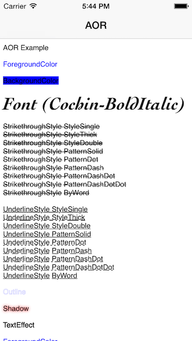
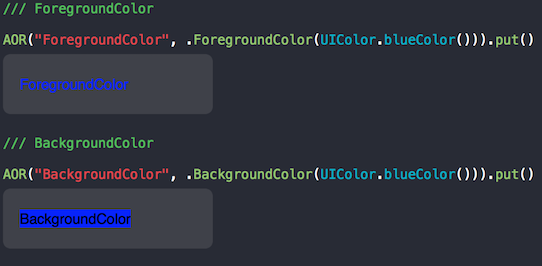
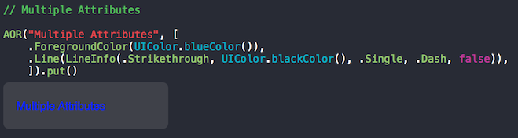
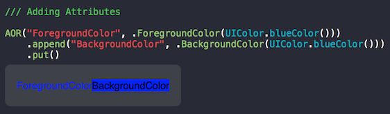
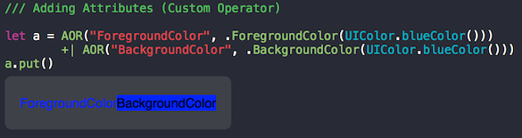
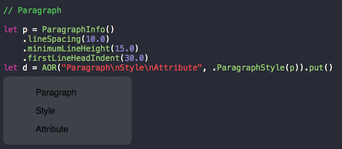

# AOR

[](http://cocoadocs.org/docsets/AOR)
[](https://developer.apple.com/swift/)
[](https://developer.apple.com/swift/)
[](https://developer.apple.com/swift/)



Wrapper of NSAttributedString and Text Kit. written in Swift.

## Exsample

### Basics



### Multiple Attributes



### Adding Attributes



### Adding Attributes (Custom Operator)



### Paragraph



### Text Kit Support

#### Line Count

```swift
AOR("any....").lineCount(self.textView.size) // -> Int
```

#### Line of Rect

```swift
AOR("any....").lineRects(self.textView.size) // -> [CGRect]
```

#### Line of Range

```swift
AOR("any....").lineRanges(self.textView.size) // -> [NSRange]
```

#### Line of String

```swift
AOR("any....").lineStrings(self.textView.size) // -> [String]


AOR("any....").lineAttributedStrings(self.textView.size) // -> [NSAttributedString]
```

## Requirements

* Xcode 10+

|            | OS                         | Swift         |
|------------|------------------|--------------|
| **v1.1.0** | iOS 9+ | 3.0      |
| **v1.2.x** | iOS 9+ | 3.2      |
| **v1.3.x** | iOS 9+ | 4.0      |
| **v1.4.x** | iOS 9+ | 4.2      |


## Installation

### CocoaPods

AOR is available through [CocoaPods](http://cocoapods.org). To install
it, simply add the following line to your Podfile:

```ruby
use_frameworks!

pod "AOR"
```

### Carthage

To integrate AOR into your Xcode project using Carthage, specify it in your Cartfile:

```ruby
github "xxxAIRINxxx/AOR"
```

## License

MIT license. See the LICENSE file for more info.
